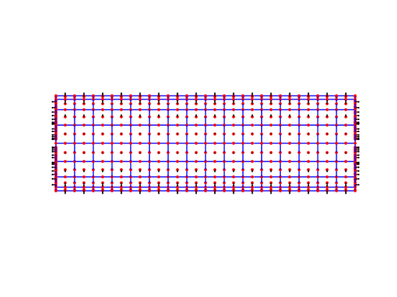
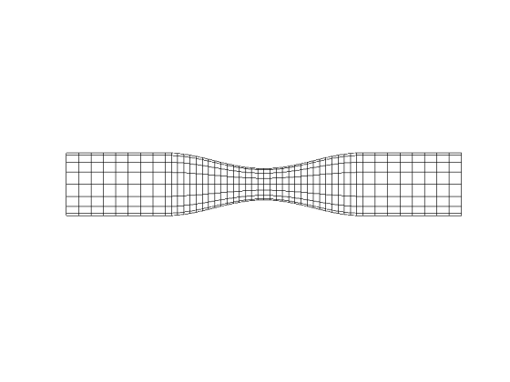
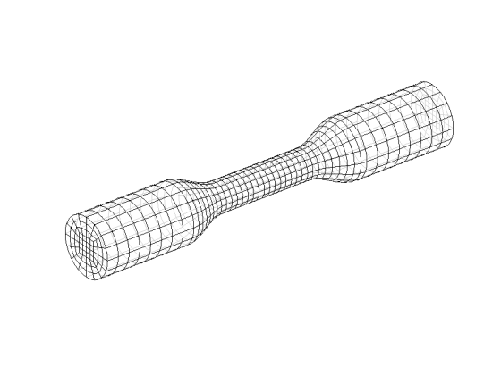
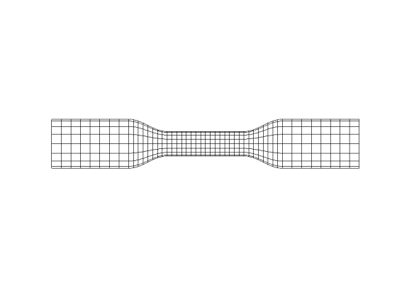

# Mesh Gallery

### Cylindrical models with 16 elements around the circumference
----

#### ShortMicrocapillary_16El

Geometry of mesh. Nodes depicted by red dots and the unit normal vector pointing outward

|3D view| XY-view|
| :-: | :-: |
|||

##### Mesh features
The length of the vessel is equal to the circumference.

| Diameter | Length | # of elements | # of nodes |
| :-: | :-: | :-: | :-: |
| 10 $\mu$m (3.5481)| 31.4159 $\mu$m (11.1466) | 384 | 1538 |

The values inside the parantheses are for non-dimensional values.

----
#### RefinedConstrictedVessel_16El

Geometry of mesh

|3D view| XY-view|
| :-: | :-: |
|||

##### Mesh features
The length of the vessel is equal to the twice of circumference at the inlet.

| Inlet Dia. | Constriction Dia. | Outlet Dia. | Length | # of elements | # of nodes |
| :-: | :-: | :-: | :-: | :-: | :-: |
| 10 $\mu$m (3.5481)| 5 $\mu$m (1.7740)| 10 $\mu$m (3.5481)| 62.83 $\mu$m (22.2932) | 896 | 3586 |

The values inside the parantheses are for non-dimensional values.

- The constricted part discretized by finer mesh.

----
#### LongConstrictedVessel_16El

Geometry of mesh

|3D view| XY-view|
| :-: | :-: |
|||

##### Mesh features
The length of the vessel is equal to the twice of circumference at the inlet.

| Inlet Dia. | Constriction Dia. | Outlet Dia. | Length | # of elements | # of nodes |
| :-: | :-: | :-: | :-: | :-: | :-: |
| 10 $\mu$m (3.5481)| 5 $\mu$m (1.7740)| 10 $\mu$m (3.5481)| 62.83 $\mu$m (22.2932) | 896 | 3586 |

The values inside the parantheses are for non-dimensional values.

- The constricted part discretized by finer mesh
