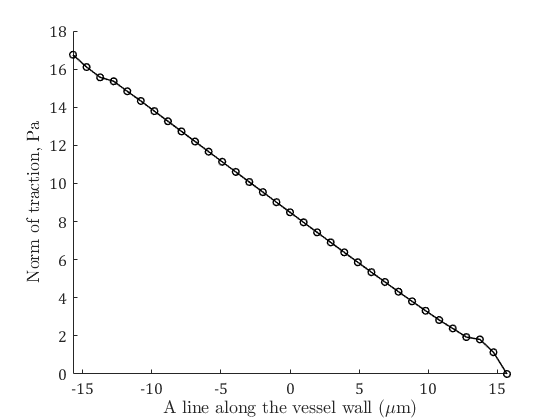
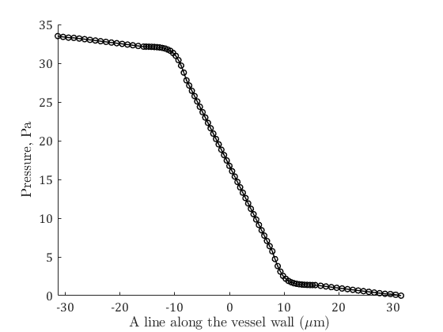

# StokesFlowInRigidTube.m

- High-order weakly singular boundary element method code is presented for analyzing pressure-driven viscous flow in the rigid vessel with varying cross-sections.
- This code was developed for part of [my dissertation](https://www.researchgate.net/publication/355033649_Simulations_of_Red_Blood_Cell_Flow_by_Boundary_Integral_Methods) to simulate the red blood cell flow using boundary integral methods.
- This repository contains the code for the concepts and examples presented in Chapter 5.

## Numerical examples

|Straight vessel| Constricted vessel | Long constricted vessel |
| :-: | :-: | :-: |
||||
| | Speed profile | |
||||
||||
||||
| | Velocity vector fields | |
||||
||||
| | Norm of traction | |
||||
||||
| | Pressure | |
||||
||||
| | Norm of shear | |
||||
||||

## Citation

    @phdthesis{gurbuz2021Thesis,
    title={Simulations of Red Blood Cell Flow by Boundary Integral Methods},
    author={G\"urb\"uz, Ali},
    year={2021},
    school={State University of New York at Buffalo}
    }
